#### 产品介绍

一句话版本

把声音的色彩记录在图片之中，回忆难忘时光

一分钟版本

人们毕业后的处境往往不一样，有人过的好，有人过的不好这都是正常的，而当长时间没有联系的大家想重温校园时光时，使用微信等社交软件就不可避免的会产生两种情况，一种是直接发消息的冷冰冰，一种是因为害怕尴尬而不好意思发语音。所以针对这种不想过分暴露目前状态，却又想和同学联系的痛点。该服务旨在为有毕业相册需求的学生提供后期交流。通过以被记录的声线交流的方式，可以很好的满足人们在保护自身当下状态的同时的语音交流需求。并在亲切和怀念的氛围，进行沟通

400秒版本

[ppt介绍](20×20.pptx)

### 价值主张

#### Api价值主张：
可以对用户的声纹进行确定，并与对应已上传的声纹库进行对接，或者使用图像识别的功能，锁定该用户对应的位于相册的id，从而调取相对应的已经训练好的语音合成包，能够把用户上传的语音信息转化为文字，并使用该语音合成包，回馈给用户一段年轻嗓音的音频从而在声音留言栏实现回到年轻嗓音的状态来交流。

#### 核心价值 
该服务旨在为有毕业相册需求的学生提供后期交流。通过以被记录的声线交流的方式，可以很好的满足人们在保护自身当下状态的同时的语音交流需求。并在亲切和怀念的氛围，进行沟通

#### 用户痛点：
人们毕业后的处境往往不一样，有人过的好，有人过的不好这都是正常的，而当长时间没有联系的大家想重温校园时光时，使用微信等社交软件就不可避免的会产生两种情况，一种是直接发消息的冷冰冰，一种是因为害怕尴尬而不好意思发语音。所以针对这种不想过分暴露目前状态，却又想和同学联系的痛点，我希望上述服务可以解决这一问题。

####  需求列表与人工智能API加值
语音合成（把转化后的文本和id同时上传后返回个人毕业时的声音在留言栏上）

声纹识别（通过声纹锁定个人图像在集体照位置）

人脸/图片识别（人脸检测、人脸对比，锁定个人图像在集体照的位置，并同时锁定id）

## API 产品使用关键AI或机器学习之API的输出入展示
### API1.使用水平
api类别|功能|输入|输出
:--|:--|:--|:--
人脸检测|生成人员id|用户上传的合照|合照图片中每个人像的id
人脸对比|头像锁定|用户人脸的照片|用户上传的图片对应的人像id
声纹识别|声纹锁定|用户说话的音频|人像对应的id
语音合成|收集语音、留言栏|用户输入文字的文本|用户过去的声音来念文字的音频

### API2.使用比较分析

	
#### 人脸检测比较
平台名称|图片|识别人脸数量|本来人脸数量
:--|:--|:--|:--
face++|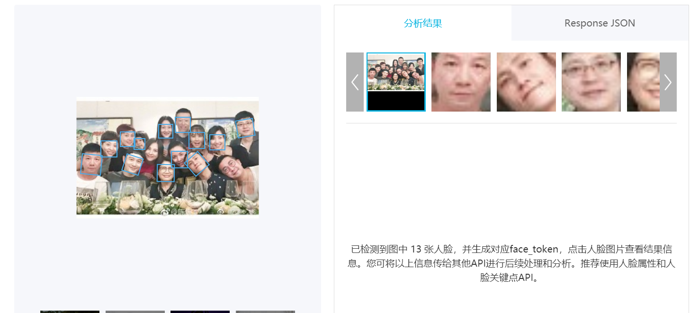|13|15
百度|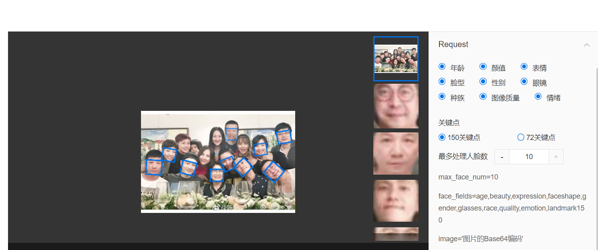|10|15

从测试结果来看，两家平台都未达成检测到全部人脸的级别。
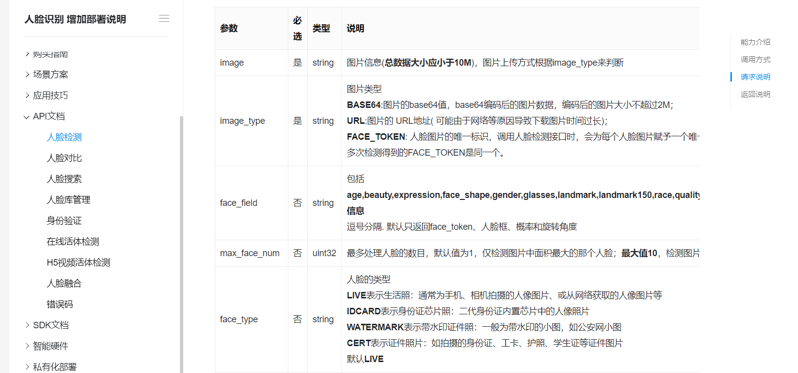

但由于百度人脸检测有人脸上限，考虑到我们可能涉及到要检测有几百人脸的照片，所以face++更加合适

#### 人脸对比比较

平台名称|图片1|相似度|图片2|相似度
:--|:--|:--|:--|:--
百度|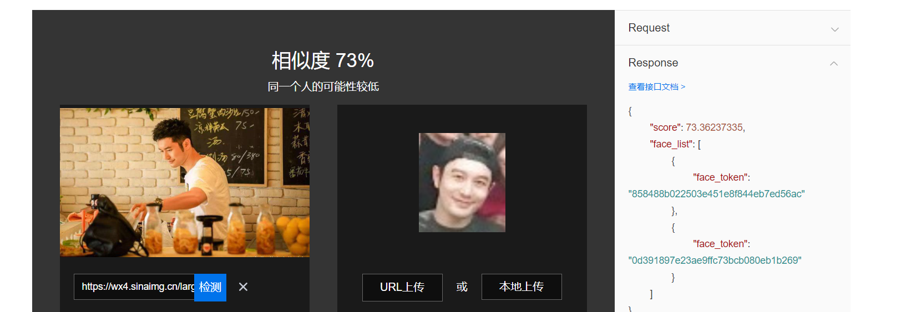|73%|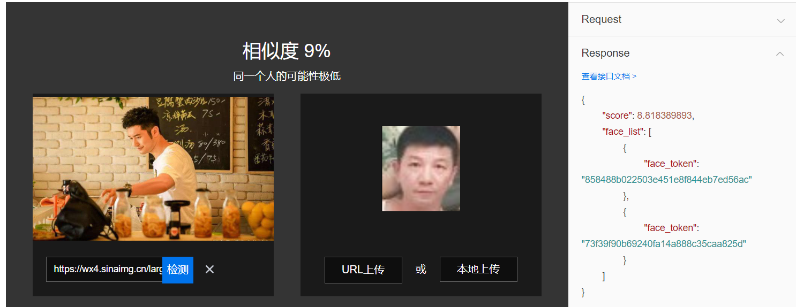|9%
face++|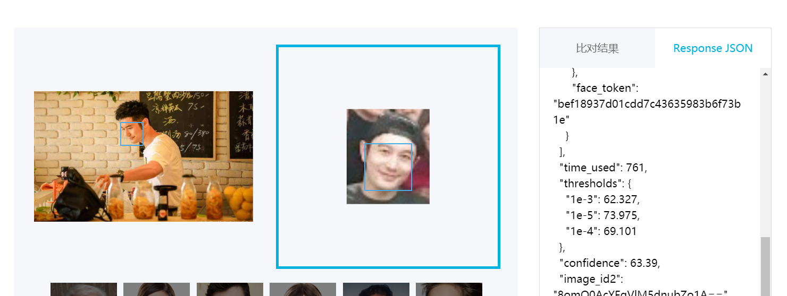|63%|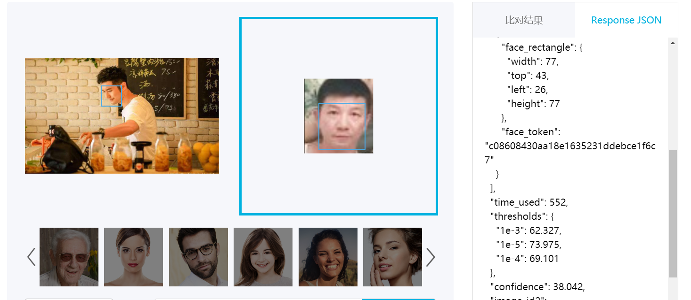|38%

通过以上对比分析，我们能够发现在判断是否为同一个人时，百度的似乎更加可信，可是如果从对比后的结果来看，在没有其它条件介入时
两者其实都是判断准确的，而在我们的服务中，我们只需要达到置信度最高即可判断照片位置，所以这种置信度之间的差距并不会影响最终的结果判断。

#### 声纹识别比较
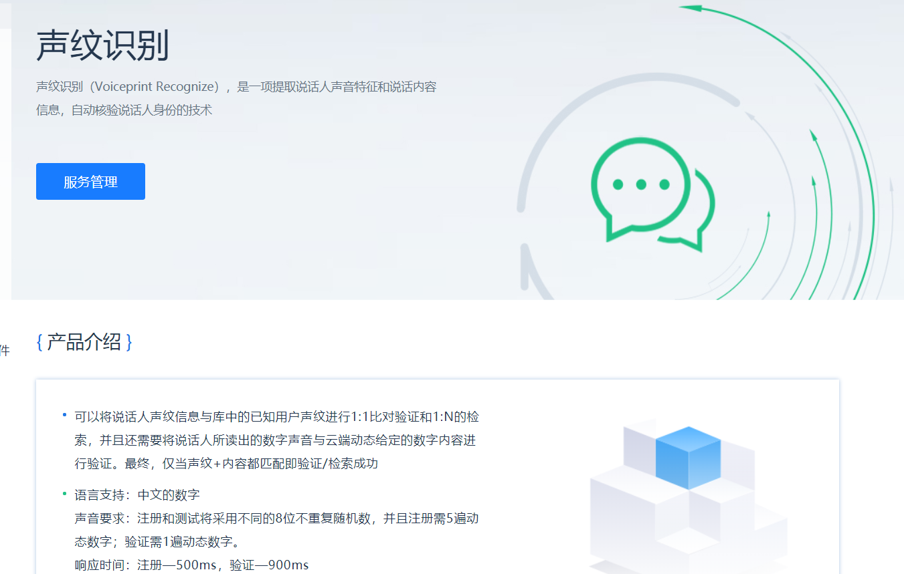

声纹识别本来一开始属于考虑功能内，但查看相关 文档后，发现了声纹识别需要满足文本和声音内容相匹配才行，而我们的服务提供声纹的目的是锁定位置，
在考虑到用户不会为一件简单的事情做繁琐的声纹识别认证的行为后，我就不再搜集相关内容了
#### 语音合成比较
目前由于语音合成技术还不够完善，定制化语音合成往往需要有专业的录音环境和设备才能实现的较为完美，
但在国内市场，科大讯飞提供的该服务，经过我的尝试，发现在通过10段短文本音频输入后，效果是极其不错的
（而且极其可靠，曾连续十二年在国际语音合成大赛上夺冠）

由于科大讯飞的该项服务的提供是要先计费和申请后才能使用，所以在判断该项服务可不可靠，我开始尝试使用了
基于该项服务开发的讯飞留声。通过使用，我大致了解到了该项服务的步骤流程。

一、获得权限，告知规则和注意事项

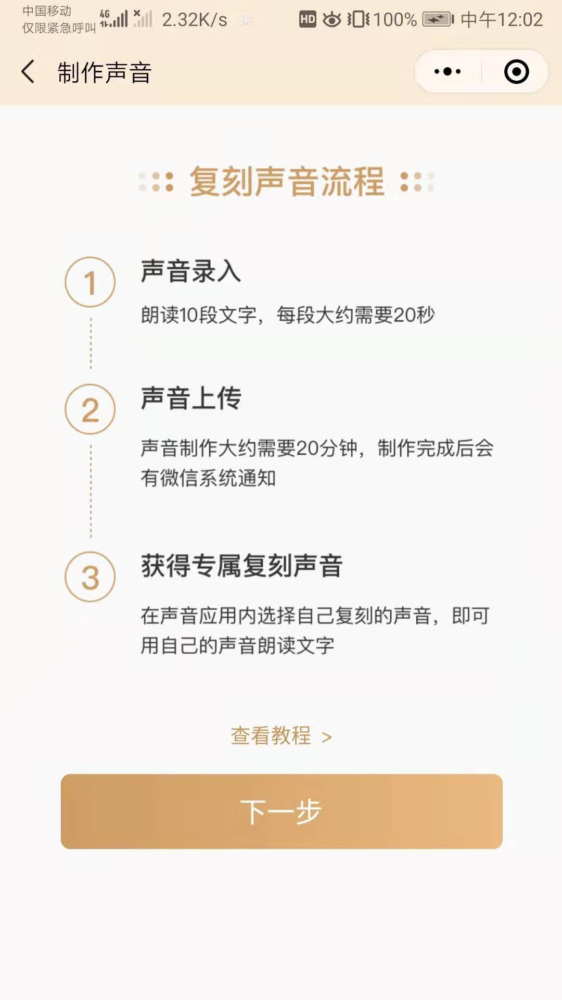

二、根据文本进行录音
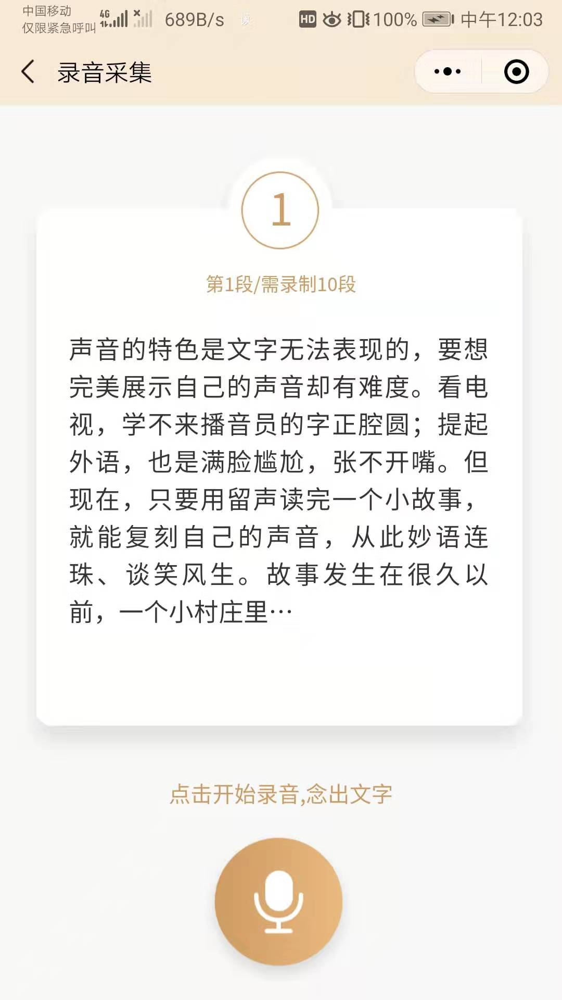

三、等待语音合成，最终反馈

最终，经过我的尝试我使用该项服务生成了基于我的语音合成生成的20×20的音频。但由于收费标准基于项目具体大小而定，还需经过科大讯飞审核，故
无法给出具体内容。
[录音效果](录音效果.wav)

而在国际市场上微软Microsoft的自定义声音Custom Voice也是一项选择。

微软的该项服务流程也大致相同

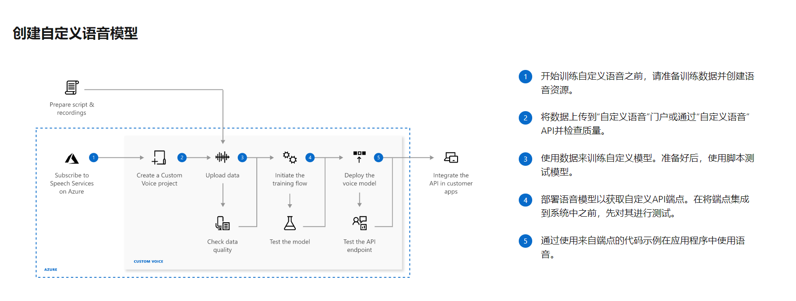

一、准备训练数据并创建语音资源。

二、将数据上传到“自定义语音”门户或通过“自定义语音” API并检查质量。

三、使用数据来训练自定义模型。准备好后，使用脚本测试模型。

四、部署语音模型以获取自定义API端点。在将端点集成到系统中之前，对其进行测试。

五、通过使用来自端点的代码示例在应用程序中使用语音。

在这里我就不具体讲述流程，但大家可以查看生成效果的音频。我也将原训练的所有数据也上传了。

测试效果：我们可以发现在相同量级数据测试下：合成语音效果科大讯飞质量更高，且更加快捷方便。

#### 收费标准

百度收费标准：

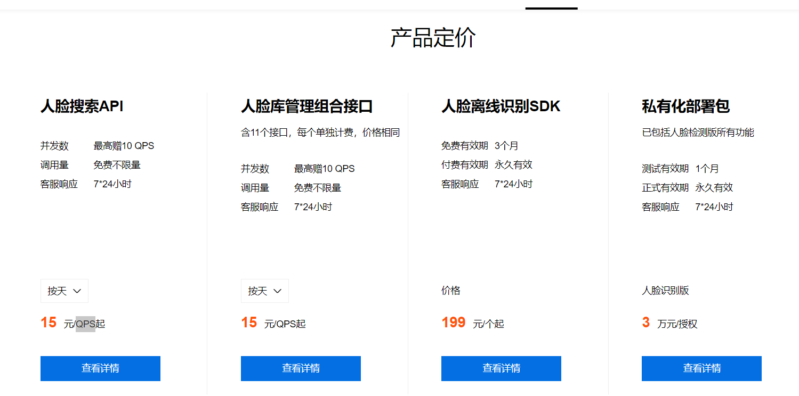

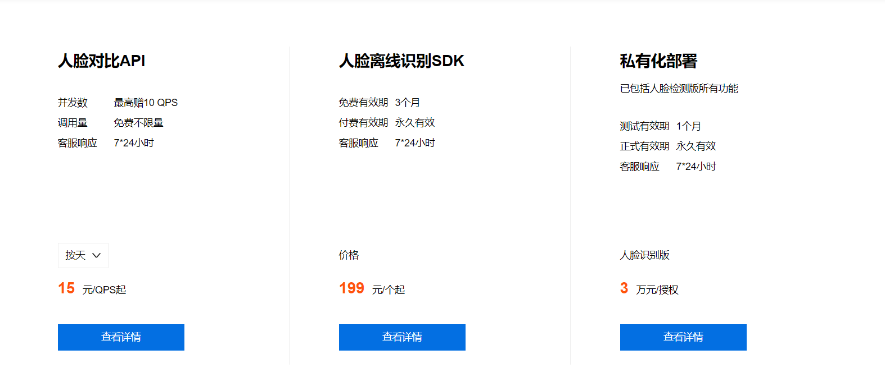

face++收费标准：

科大讯飞收费标准：
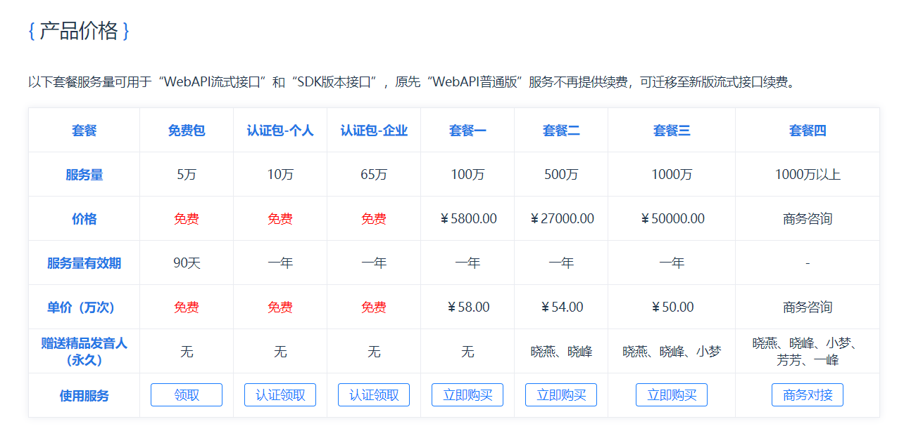

微软收费标准：

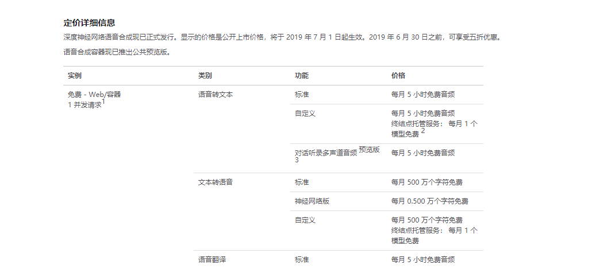

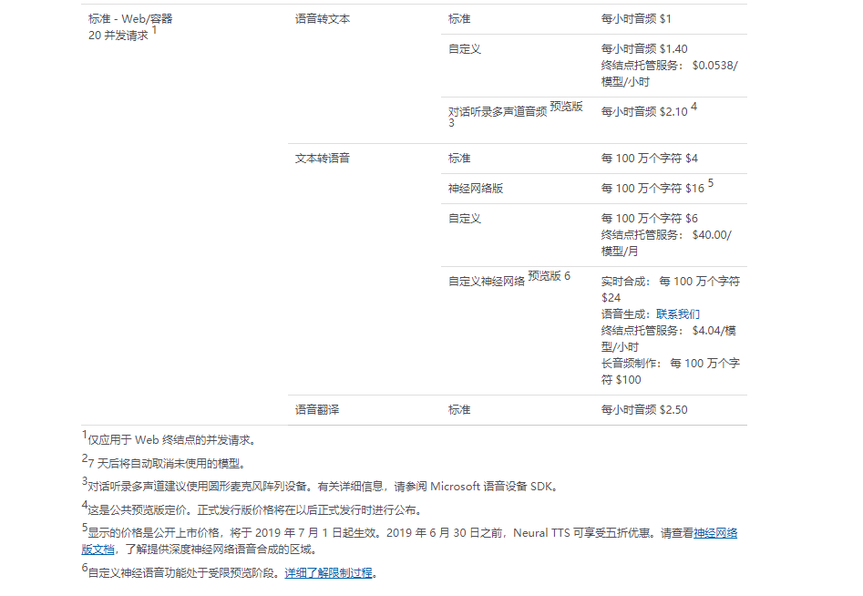

经过多方面的考虑，目前在人脸识别上统一使用face++的api和在语音合成方面使用科大讯飞的服务是最优质的选择。

### API3.使用后风险报告 

#### 新痛点：
声音采集耗时长，花费高，用户为在校学生
将讯飞留声，讯飞有声的功能整合
#### 可行的解决方案：
可选方案1、一次性连同数字相册搭建一同付清，

2、在付清数字相册搭建收费后＋未来使用语音留言的收费）
#### 面对风险：
在国内市场，可达讯飞毕竟已提供该服务很成熟了（可靠，连续十二年在国际语音合成大赛上夺冠）

虽然阿里的新一代语音合成技术kan-tts，让合成定制成本降低10倍以上。目前已经向b端客户开放，且后期个人用户也可只需10分钟手机录音，就可以定制ai录音。但是目前也没有看到它开始进行开源的行为。
所以未来，科大讯飞所提供的语音合成api所被挑战的难度还是很大的。

可由于微软收费更加便宜且支持免费，虽然前期效果不如人意，但一旦数据量大了，我们就可以使用自己的数据，利用微软的算法来进行语音合成。 

至于像人脸识别方面，face++的性价比实在太高，可替代性不大。

经过多人的使用实验后，我发现了一个最让大家诟病的点，就是留言栏功能太像聊天了。

经过再次明确和判断，最终我们都认为智能相册留言栏的功能实际上是个记录功能，而不是聊天功能。

所以虑到这一情况，在后期，应当对留言次数做出限制，这样才会让人们知道记录的可贵性，而会慎重对待，每一句留言。

### 原型

产品架构图

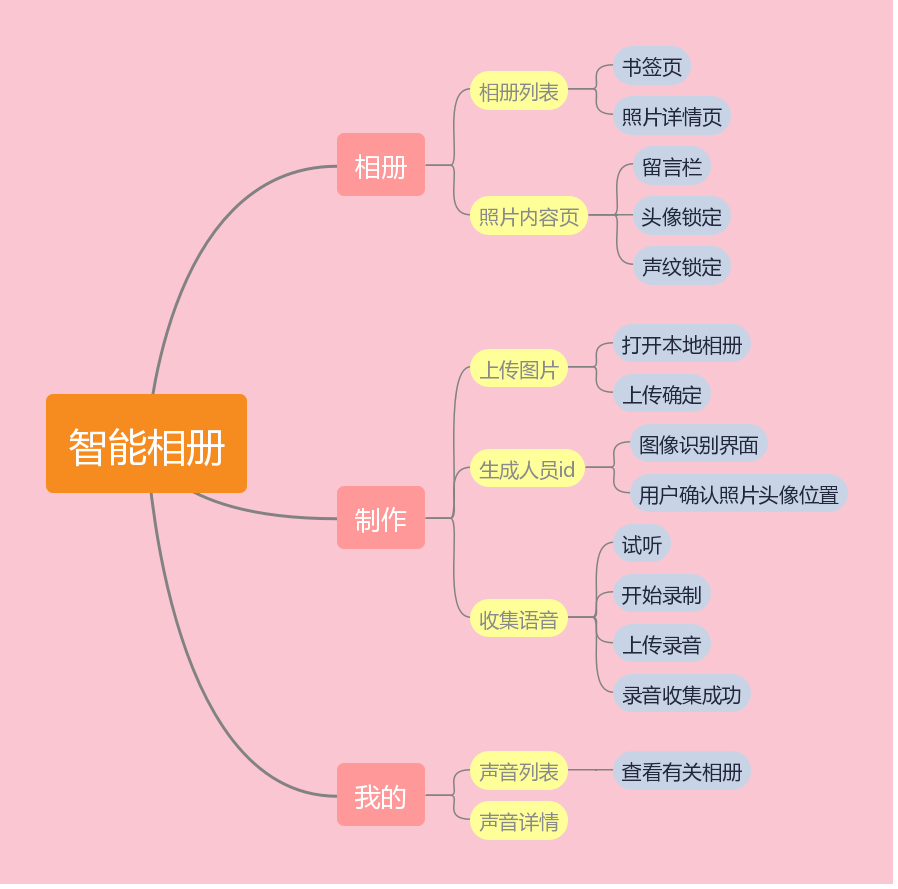

### 原型1.交互及界面设计
交互及界面设计：原型开始制作中，我们的核心交互就是用户通过新建图片，并通过机器学习的方式从用户提供的声音数据中进行语音合成服务最终提供留言功能。
### 原型2.信息设计 
信息设计：原型我的页面中，会记录和该名用户记录的声音库，而这些声音类别是通过语音合成功能建立起来的，用户可以根据需求，查看自己不同的声音类型。
原型相册页面中，会记录该名用户记录的图片，并会显示该名用户在该图片所对应的id位置和语音类别。
### 原型3.原型文档

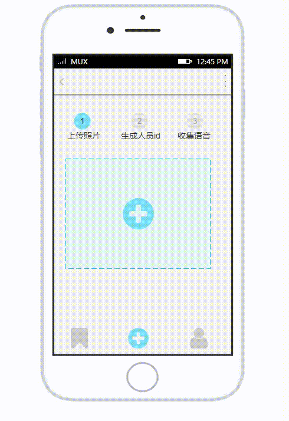

我已将axure文档上传
[api](api.rp)

### 原型4.口头操作说明

我已将axure音频文档上传
[原型录屏](原型录屏.mp4)
